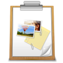

# Clipboard Viewer

## Description

The ClipboardViewer is an application to view clipboard content, list current content and can display certain formats, unsupported formats is open in a hexadecimal viewer.

## Supperted formats

- CF_TEXT
- CF_UNICODETEXT
- CF_HDROP
- FileName
- FileNameW
- Shell IDList Array
- CF_DIB
- CF_DIBV5 (parcial)
- PNG
- GIF
- JFIF
- HTML Format
- Rich Text Format
- image/svg+xml
- image/svg+xml-compressed
- image/x-inkscape-svg
- image/x-inkscape-svg-compressed
- Object Descriptor
- Link Source Descriptor
- Axialis DIB32 Data
- image/png
- image/bmp
- image/ico
- image/jpg
- image/jpeg
- image/ppm
- image/tif
- image/tiff
- image/xbm
- image/xpm
- Cvs
- XML Spreadsheet
- Preferred DropEffect
